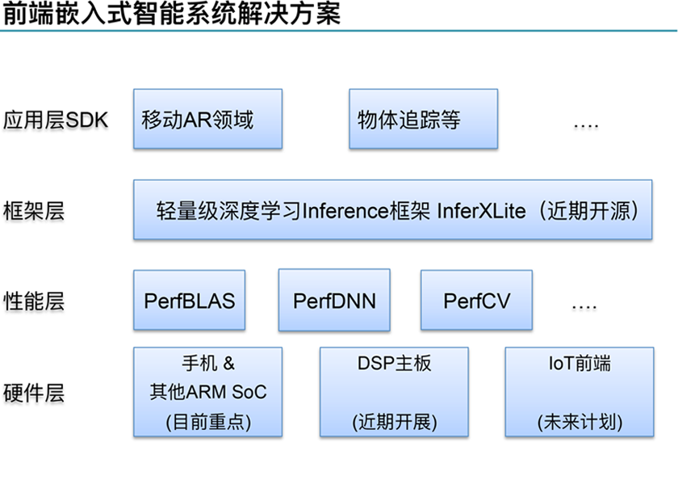
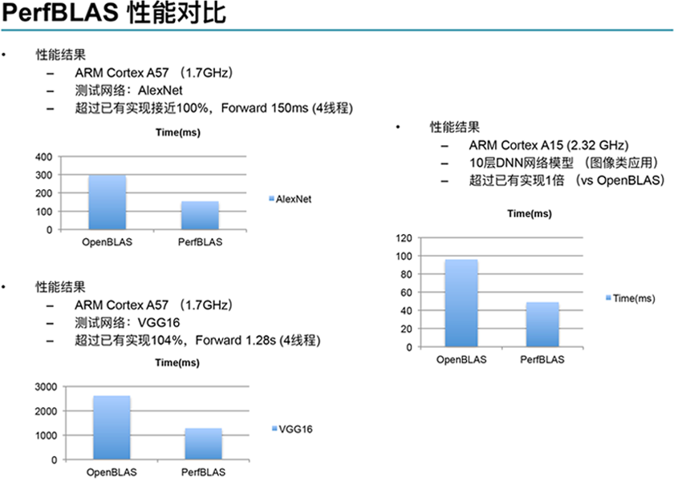
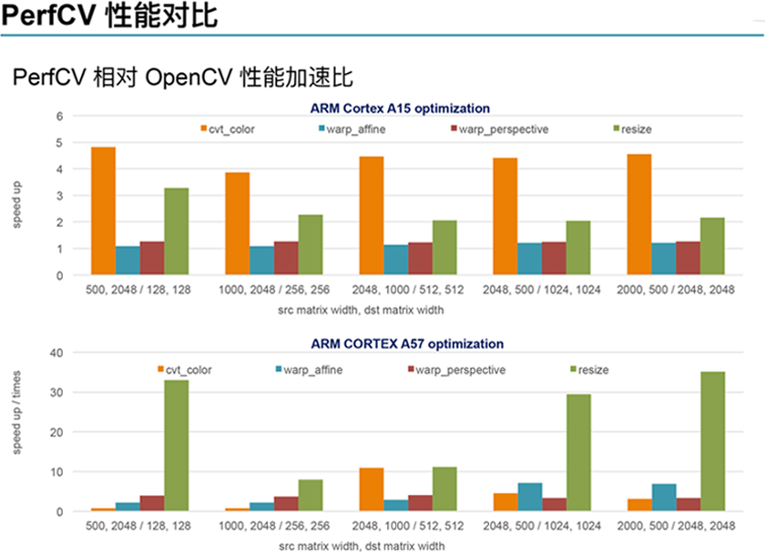
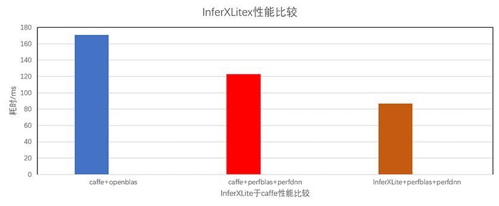

</style>
<h3 id="about_us" style="color:#0071bc;text-align:center;font-size:2rem;padding-top:2rem">关于-我们</h3>

	
PerfXLab澎峰科技

	
领先的基于计算的AI+技术公司

	
覆盖前端嵌入式智能系统+云端通用化只能平台

	
独到的技术（OpenBLAS）

	
优秀的人才（源自中科院）

<h3 id="product" style="color:#0071bc;text-align:center;font-size:2rem;padding-top:2rem">产品-简介</h3>

